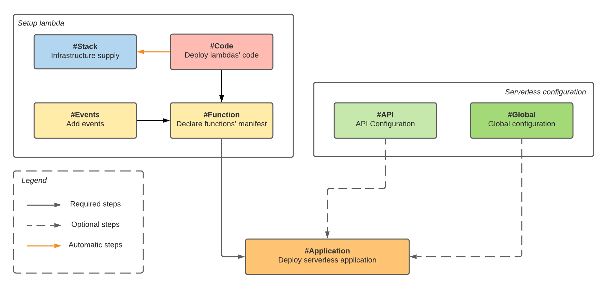

# Dagger serverless package

A [dagger](https://dagger.io/) package aiming to help you deploy serverless applications with ease.

## :closed_book: Description

This package is a superset of [AWS SAM](https://docs.aws.amazon.com/serverless-application-model/latest/developerguide/what-is-sam.html), which allows you to build and deploy Lambda function(s). <br>
Furthermore, you can also configure [events](https://docs.aws.amazon.com/serverless-application-model/latest/developerguide/sam-property-function-eventsource.html) or [Gateway](https://docs.aws.amazon.com/serverless-application-model/latest/developerguide/sam-resource-api.html) and even extend the actual package to match your needs.

The aim is to integrate the lambda deployment to your current [dagger](https://dagger.io/) pipeline. This way, you can __build__, __configure__ and __deploy__ with a single [dagger environment](https://docs.dagger.io/1004/dev-first-env/).

## :hammer_and_pick: Installation 

You can install the latest release with

```bash
dagger mod get github.com/grouville/dagger-serverless/serverless
```

## :beginner: Quickstart

You can discover examples in the [examples folders](./examples), or you can follow the [tutorial](./tutorial) to learn step by step how to deploy a serverless function with dagger from scratch.

## :zap: Features

### Workflow



### Events

| Event                                                                                                                 | Description  	|  
|---	                                                                                                                |---	        |
| [API](https://docs.aws.amazon.com/serverless-application-model/latest/developerguide/sam-property-function-api.html)  | Http endpoint |  
| [SQS](https://docs.aws.amazon.com/serverless-application-model/latest/developerguide/sam-property-function-sqs.html)  | Simple queue  |  

### Secrets management

The `serverless` package has [aws secret](./serverless/aws/secretmanager) integration.

> :bulb: [Examples](./examples/secret)

### Layers

To simplify the management of your lambdas' dependencies, it's now possible to use [layers](./serverless/layers.cue).

> :bulb: [Examples](./examples/layers)

### Upcoming

- Custom domain integration for API
- Others [events](https://docs.aws.amazon.com/serverless-application-model/latest/developerguide/sam-property-function-eventsource.html)
- ALB integration

## :handshake: Contributing

If you have a specific need, don't hesitate to write an [issue](https://github.com/grouville/dagger-serverless/issues) or create a [pull request]((https://github.com/grouville/dagger-serverless/pulls)) on our repository! :rocket:

See the workflow below to contribute.

### Workflow

- [Fork the repository](https://github.com/grouville/dagger-serverless/fork)
- Clone this repository : `git clone git@github.com:grouville/dagger-serverless.git`
- Add your **fork** to the remote : `git remote add <fork name> git@github.com:<your github name>/dagger-serverless.git`
- Create a branch : `git checkout -b <my cool branch name>`
- Commit your change `git commit -S -m "Add a new cool feature..."`
- Push your work `git push <fork name> <my cool branch name>`
- Open a [Pull Request](https://github.com/grouville/dagger-serverless/pulls)

> :bulb: Check that [post](https://chris.beams.io/posts/git-commit/) to learn how write good commit message

## 	:superhero_man: Maintainers

- [Guillaume de Rouville](https://github.com/grouville)
- [Tom Chauveau](https://github.com/TomChv)