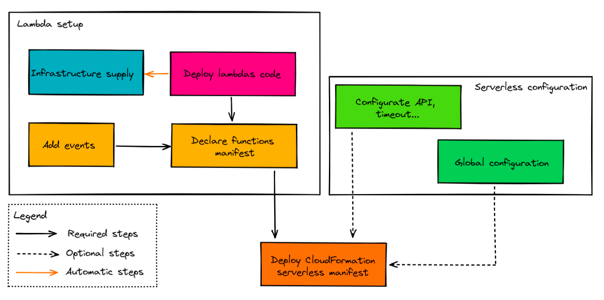

# Dagger serverless package

A [dagger](https://dagger.io/) package to deploy serverless application with ease.

## :closed_book: Description

This package is a superset of [AWS SAM](https://docs.aws.amazon.com/serverless-application-model/latest/developerguide/what-is-sam.html) which allow you to build and deploy your lambda function(s).  
But that not all, you can also configure [events](https://docs.aws.amazon.com/serverless-application-model/latest/developerguide/sam-property-function-eventsource.html) or [Gateway](https://docs.aws.amazon.com/serverless-application-model/latest/developerguide/sam-resource-api.html) and even extend the actual package to match with your needs.

The aim is to integrate the lambda deployment to your current [dagger](https://dagger.io/) pipeline. This way, you can __build__, __configure__ and __deploy__ with a single [dagger environment](https://docs.dagger.io/1004/dev-first-env/).

## :hammer_and_pick: Installation 

Currently, you need to download the latest of the package

## Examples 

You can discover examples in the [examples folders](./examples) or you can follow the [tutorial](./tutorial) to learn step by step how deploy serverless function with dagger.

## :zap: Features

### Workflow

### Events

| Event                                                                                                                 | Description  	|  
|---	                                                                                                                |---	        |
| [API](https://docs.aws.amazon.com/serverless-application-model/latest/developerguide/sam-property-function-api.html)  | Http endpoint |  
| [SQS](https://docs.aws.amazon.com/serverless-application-model/latest/developerguide/sam-property-function-sqs.html)  | Simple queue  |  

### Upcoming

- Secrets management
- Custom domain integration for API
- Others [events](https://docs.aws.amazon.com/serverless-application-model/latest/developerguide/sam-property-function-eventsource.html)

## :handshake: Contributing

If you got particular needs, don't hesitate to write an [issue](https://github.com/grouville/kickMySAM/issues) or create a [pull request]((https://github.com/grouville/kickMySAM/pulls)) on our repository ! :rocket:

### Workflow

- [Fork the repository](https://github.com/grouville/kickMySAM/fork)
- Clone this repository : `git clone git@github.com:grouville/kickMySAM.git`
- Add your **fork** to the remote : `git remote add <fork name> git@github.com:<your github name>/kickMySAM.git`
- Create a branch : `git checkout -b <my cool branch name>`
- Commit your change `git commit -S -m "Add a new cool feature..."`
- Push your work `git push <fork name> <my cool branch name>`
- Open a [Pull Request](https://github.com/grouville/kickMySAM/pulls)

> :bulb: Check that [post](https://chris.beams.io/posts/git-commit/) to learn how write good commit message

## 	:superhero_man: Maintainers

- [Guillaume de Rouville](https://github.com/grouville)
- [Tom Chauveau](https://github.com/TomChv)